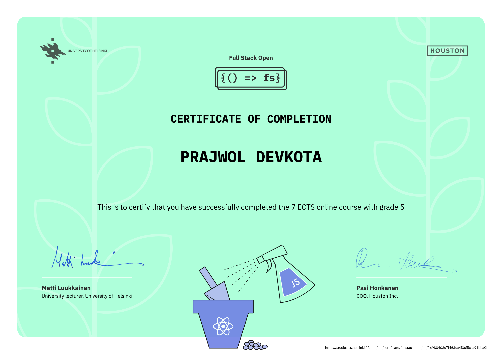

# Full Stack open

This repository showcases my journey through the [**Full Stack Open**](https://fullstackopen.com/en/) course from the University of Helsinki.

---

## Course Overview

Learn **React**, **Redux**, **Node.js**, **MongoDB**, **GraphQL** and **TypeScript** in one go! This course will introduce you to modern JavaScript-based web development. The main focus is on building single page applications with **ReactJS** that use **REST APIs** built with Node.js.

---

### **Part 0: Fundamentals of Web Apps**

- Learn the basics of web applications.
- Understand how web servers and browsers communicate.
- Introduction to HTTP protocols, APIs, and debugging.

### **Part 1: Introduction to React**

- Familiarizing with the React library and some features of JavaScript that are important for understanding React.
- Learn about components, props, and state.
- Build simple React applications.

### **Part 2: Communicating with Server**

- Continuation of the introduction to React.
- Includes data rendering, data submission with HTML forms, fetching data from a remote backend server, and applying simple CSS styles.

### **Part 3: Programming a Server with NodeJS and Express**

- Focuses on implementing and deploying a simple REST API to the internet.
- The application is developed using **Node.js** and the **Express** library.
- The application data is stored in a **MongoDB** database.

### **Part 4: Testing Express Servers, User Administration**

- Focuses on the backend.
- Key topics include writing unit and integration tests and implementing user authentication and authorization.

### **Part 5: Testing React Apps**

- Deals with testing React code and token-based authentication.
- Learn about **Jest**, **React Testing Library**, and **Cypress**.

### **Part 6: Advanced State Management**

- Introduction to the **Redux** library as a solution for managing the state of React applications.
- Redux provides a centralized state management solution, simplifying state updates, enhancing predictability, and facilitating debugging in complex React applications.

### **Part 7: React Router, Custom Hooks, Styling App with CSS and Webpack**

- Getting familiar with **React Router** as a way to divide the application into different views based on the URL.
- Learn about custom hooks, different ways to style React applications, and **Webpack**.

### **Part 8: GraphQL**

- Introduction to **GraphQL** as an alternative to REST communication between the browser and server.
- GraphQL allows clients to request precisely the data they need, reducing over-fetching and under-fetching, leading to more efficient and flexible APIs.

### **Part 9: TypeScript**

- Introduction to **TypeScript**, a typed superset of JavaScript.
- TypeScript offers static typing, enhancing code quality by catching errors at compile-time, improving code maintainability, and enabling better IDE support.

---

## My Course Progress

- [x] **part0**: Fundamentals of Web Apps
- [x] **part1**: Introduction to React
- [x] **part2**: Communicating with Server
- [x] **part3**: Programming a Server with NodeJS and Express
- [x] **part4**: Testing Express Servers, User Administration
- [x] **part5**: Testing React Apps
- [x] **part6**: Advanced State Management
- [ ] **part7**: React Router, Custom Hooks, Styling App with CSS and Webpack
- [ ] **part8**: GraphQL
- [ ] **part9**: TypeScript

---

## Course Certificates

### Full Stack Certificate - Parts 0-7

### GraphQL Certificate - Part 8

---
