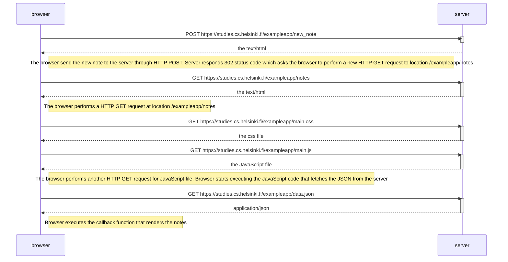

```mermaid
sequenceDiagram
    participant browser
    participant server

    browser->>server: POST https://studies.cs.helsinki.fi/exampleapp/new_note
    activate server
    deactivate server
    server-->>browser: the text/html

    Note right of browser: The browser send the new note to the server through HTTP POST. Server responds 302 status code which asks the browser to perform a new HTTP GET request to location /exampleapp/notes

    browser->>server: GET https://studies.cs.helsinki.fi/exampleapp/notes
    activate server
    server-->>browser: the text/html
    deactivate server

    Note right of browser: The browser performs a HTTP GET request at location /exampleapp/notes

    browser->>server: GET https://studies.cs.helsinki.fi/exampleapp/main.css
    activate server
    server-->>browser: the css file
    deactivate server

    browser->>server: GET https://studies.cs.helsinki.fi/exampleapp/main.js
    activate server
    server-->>browser: the JavaScript file
    deactivate server

    Note right of browser: The browser performs another HTTP GET request for JavaScript file. Browser starts executing the JavaScript code that fetches the JSON from the server

    browser->>server: GET https://studies.cs.helsinki.fi/exampleapp/data.json
    activate server
    server-->>browser: application/json
    deactivate server

    Note right of browser: Browser executes the callback function that renders the notes
```
