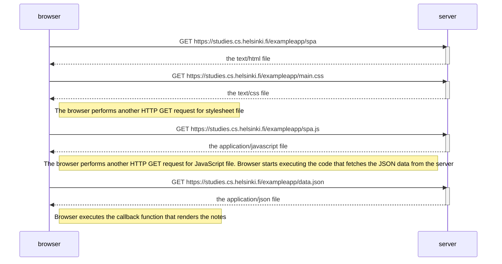

```mermaid
sequenceDiagram
    participant browser
    participant server

    browser->>server: GET https://studies.cs.helsinki.fi/exampleapp/spa
    activate server
    server-->>browser: the text/html file
    deactivate server

    browser->>server: GET https://studies.cs.helsinki.fi/exampleapp/main.css
    activate server
    server-->>browser: the text/css file
    deactivate server

    Note right of browser: The browser performs another HTTP GET request for stylesheet file

    browser->>server: GET https://studies.cs.helsinki.fi/exampleapp/spa.js
    activate server
    server-->>browser: the application/javascript file
    deactivate server

    Note right of browser: The browser performs another HTTP GET request for JavaScript file. Browser starts executing the code that fetches the JSON data from the server

    browser->>server: GET https://studies.cs.helsinki.fi/exampleapp/data.json
    activate server
    server-->>browser: the application/json file
    deactivate server

    Note right of browser: Browser executes the callback function that renders the notes
```
