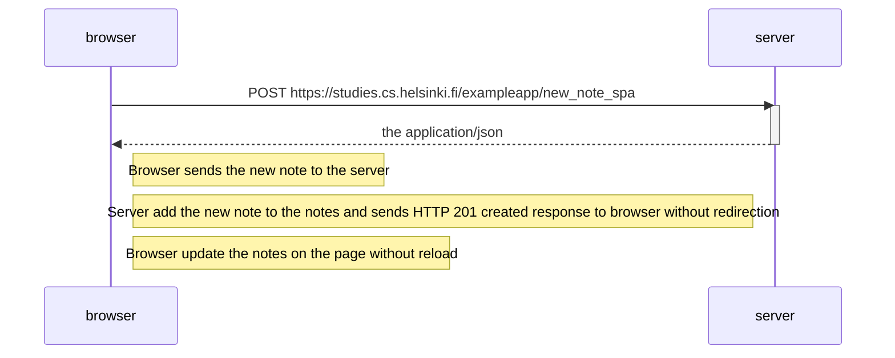

```mermaid
sequenceDiagram
    participant browser
    participant server

    browser->>server: POST https://studies.cs.helsinki.fi/exampleapp/new_note_spa
    activate server
    server-->>browser: the application/json
    deactivate server

    Note right of browser: Browser sends the new note to the server
    Note left of server: Server add the new note to the notes and sends HTTP 201 created response to browser without redirection
    Note right of browser: Browser update the notes on the page without reload
```
